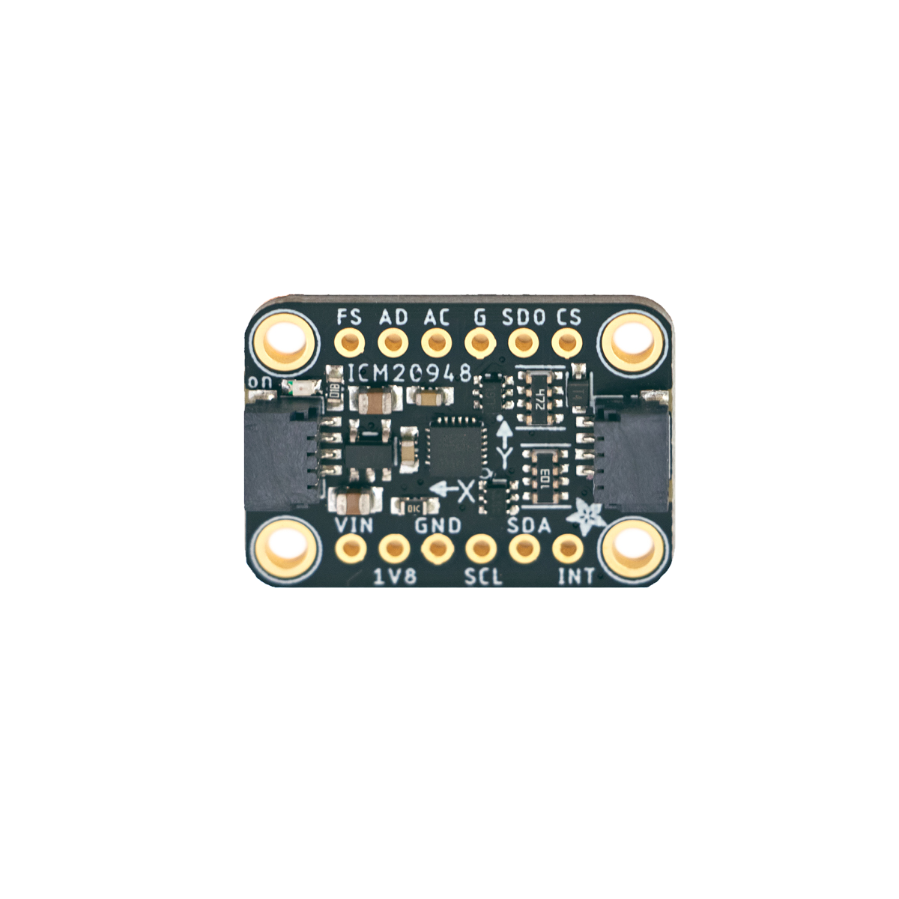

# Inertialsensor

## Beschreibung
Der TDK InvenSense ICM-20948 ist ein sogenannter neunachsiger Inertialsensor. Inertialsensoren kombinieren mehrere Sensortypen, um jegliche dreidimensionale Bewegung (Verschiebungen und Neigungen in allen Raumrichtungen) zu bestimmen.

Das Gyroskop (siehe Link am Ende der Seite) misst zu jedem Zeitpunkt die Drehraten (Drehgeschwindigkeiten) in allen drei Raumrichtungen. Der Beschleunigungssensor misst die axialen Beschleunigungen in allen drei Raumrichtungen. Theoretisch ist es bereits mit diesen sechs Messwerten möglich, die Bewegung (Verschiebungen und Neigungen in allen Raumrichtungen) nachzuvollziehen. Da insbesondere das Gyroskop oftmals driftet (mit der Zeit verschieben sich die Messwerte), kommt bei diesem IMU zusätzlich ein Magnetometer zum Einsatz. Dieses misst die Magnetfeldstärke in allen drei Raumrichtungen. Das dient insbesondere dazu, das Erdmagnetfeld als Orientierungsreferenz zu nutzen und die Gesamtmessung immer wieder zu referenzieren. Werden diese Informationen allesamt kombiniert, ist es möglich, die genaue Bewegung des Sensors nachzuvollziehen und so beispielsweise immer dreidimensional die aktuelle Position sowie die Orientierung (Neigung) des Sensors relativ zu einer Startposition zu ermitteln.

Mit diesem Sensor kann beispielsweise ein Handschuh realisiert werden, der die genaue Bewegung der Hand nachvollziehen kann. Damit wäre es zum Beispiel möglich eine Roboterhand zu steuern, welche die gleichen Bewegungen ausführt.

Der Sensor kann direkt oder mithilfe des Grove Shield an einen Arduino angeschlossen werden und verfügt dafür über einen Stemma QT-Anschluss (auch kompatibel mit Qwiic oder JST SH). Um den Sensor direkt an die Grove-Anschlüsse anzuschließen, wird der Adapter-Kabel „Grove to STEMMA QT“ benötigt. Der Sensor kommuniziert über die serielle Schnittstelle I2C.

Alle weiteren Hintergrundinformationen sowie ein Beispielaufbau und alle notwendigen Programmbibliotheken sind auf der Lernplattform von Adafruit (bisher nur in englischer Sprache) zusammengefasst. Zusätzlich findet man über alle gängigen Suchmaschinen durch die Eingabe der genauen Komponentenbezeichnung entsprechende Projektbeispiele und Tutorials.

Die genaue Bezeichnung des integrierten Sensors, die bei der Suche von Beschreibungen und Anleitungen wichtig sein kann, lautet ICM-20948.

<!-- infolist -->

<!-- infolists -->
## Wichtige Links für die ersten Schritte:

- [Für Arduino](https://learn.adafruit.com/adafruit-tdk-invensense-icm-20948-9-dof-imu/arduino)
- [Für Raspberry Pi](https://learn.adafruit.com/adafruit-tdk-invensense-icm-20948-9-dof-imu/python-circuitpython)

## Projektbeispiele:

- [Handwriting Recognition](https://www.hackster.io/naveenbskumar/handwriting-recognition-7583e3)
- [Smart Watch](https://www.hackster.io/312619/ecen-2440-smartwatch-945a26)

## Weiterführende Hintergrundinformationen:

- [## UART – Wikipedia Artikel](https://de.wikipedia.org/wiki/Universal_Asynchronous_Receiver_Transmitter)
- [## I2C – Wikipedia Artikel](https://de.wikipedia.org/wiki/I%C2%B2C)
- [## Drift – Wikipedia Artikel](https://de.wikipedia.org/wiki/Systematische_Abweichung)
- [## Magnetometer – Wikipedia Artikel](https://de.wikipedia.org/wiki/Magnetometer)
- [## Beschleunigungssensor – Wikipedia Artikel](https://de.wikipedia.org/wiki/Beschleunigungssensor)
- [## Gyroskop – Wikipedia Artikel](https://de.wikipedia.org/wiki/Kreiselinstrument)
- [## Inertialsensor – Wikipedia Artikel](https://de.wikipedia.org/wiki/Inertiale_Messeinheit)
- [## Intertialsensor - Adafruit GitHub (Englisch)](https://github.com/adafruit/Adafruit-ICM20948-PCB)
- [## Intertialsensor - _Make Your School_ GitHub (Deutsch)](https://github.com/s-light/MYS__12-Inertialsensor)

